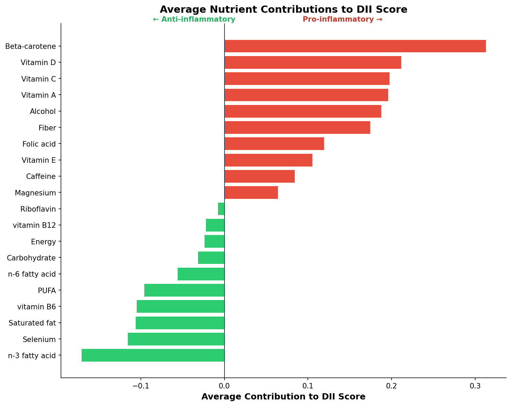
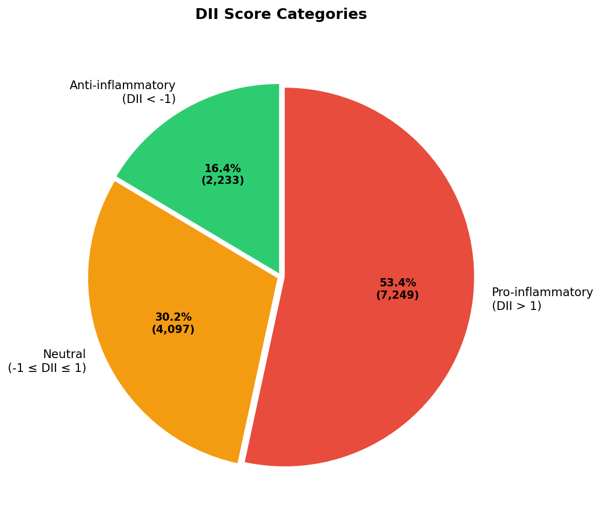

# DII Calculator

[](https://pypi.org/project/dii-calculator/)
[](https://www.python.org/downloads/)
[](https://opensource.org/licenses/MIT)
[](https://github.com/strathlab-data/DII/actions/workflows/test.yml)

**A validated Python implementation of the Dietary Inflammatory Index (DII) for nutritional epidemiology research.**

---

## Overview

The **Dietary Inflammatory Index (DII)** is a literature-derived, population-based scoring system that quantifies the inflammatory potential of an individual's diet. Originally developed by [Shivappa et al. (2014)](#references), the DII has been used in over 1,000 peer-reviewed studies to examine relationships between diet and chronic disease.

This package provides:

- **Validated calculations** matching the original methodology
- **All 45 DII food parameters** with global reference values
- **Detailed output** showing per-nutrient contributions
- **Visualization tools** for research and publication
- **Command-line interface** for batch processing

---

## Installation

### From PyPI (recommended)

```bash
pip install dii-calculator
```

### Development installation

```bash
git clone https://github.com/strathlab-data/DII.git
cd DII
pip install -e ".[dev]"
```

---

## Quick Start

```python
import pandas as pd
from dii import calculate_dii

# Load your nutrient intake data
nutrients = pd.read_csv("your_data.csv")

# Calculate DII scores
results = calculate_dii(nutrients, id_column="participant_id")
print(results)
```

**Output:**

```
   participant_id  DII_score
0               1      -2.34
1               2       0.87
2               3       3.12
```

---

## Methodology

The DII calculation follows a standardized four-step process for each nutrient:

### Step 1: Z-score

```
z = (intake - global_mean) / global_sd
```

Where `global_mean` and `global_sd` are population-level statistics derived from 11 worldwide dietary datasets.

### Step 2: Centered Percentile

```
percentile = 2 × Φ(z) - 1
```

Where Φ is the cumulative distribution function of the standard normal distribution. This transforms z-scores to the range [-1, +1].

### Step 3: Weighted Contribution

```
contribution = percentile × inflammatory_weight
```

The inflammatory weight (range: -0.785 to +0.373) was derived from a systematic review of 1,943 peer-reviewed articles examining relationships between dietary factors and six inflammatory biomarkers: IL-1β, IL-4, IL-6, IL-10, TNF-α, and CRP.

### Step 4: Total DII Score

```
DII = Σ contributions
```

Sum all nutrient contributions. Missing nutrients are excluded (not imputed).

---

## Interpretation

| DII Score Range | Category | Interpretation |
|-----------------|----------|----------------|
| < -4 | Strongly anti-inflammatory | Diet rich in anti-inflammatory foods |
| -4 to -1 | Anti-inflammatory | Generally healthy dietary pattern |
| -1 to +1 | Neutral | Mixed dietary pattern |
| +1 to +4 | Pro-inflammatory | Diet may promote inflammation |
| > +4 | Strongly pro-inflammatory | Diet dominated by pro-inflammatory foods |

**Theoretical range**: approximately **-8.87** (maximally anti-inflammatory) to **+7.98** (maximally pro-inflammatory) when all 45 nutrients are available.

---

## Input Requirements

### Data Format

Your input should be a pandas DataFrame with:
- One row per participant/observation
- Columns named to match the DII nutrient names exactly
- Numeric values representing **daily intake**

### Data Types

All nutrient values should be numeric. The package uses **float64** precision internally for reproducibility. Non-numeric values are coerced to NaN with a warning.

### Units Reference

⚠️ **Units are critical for accurate DII calculation.** Common errors include using mg instead of g for caffeine.

#### Macronutrients

| Nutrient | Column Name | Unit | Global Mean | Global SD |
|----------|-------------|------|-------------|-----------|
| Energy | `Energy` | kcal/day | 2056 | 338 |
| Carbohydrate | `Carbohydrate` | g/day | 272.2 | 40 |
| Protein | `Protein` | g/day | 79.4 | 13.9 |
| Total fat | `Total fat` | g/day | 71.4 | 19.4 |
| Fiber | `Fiber` | g/day | 18.8 | 4.9 |

#### Fatty Acids

| Nutrient | Column Name | Unit | Global Mean | Global SD |
|----------|-------------|------|-------------|-----------|
| Saturated fat | `Saturated fat` | g/day | 28.6 | 8 |
| MUFA | `MUFA` | g/day | 27 | 6.1 |
| PUFA | `PUFA` | g/day | 13.88 | 3.76 |
| Trans fat | `Trans fat` | g/day | 3.15 | 3.75 |
| n-3 fatty acid | `n-3 fatty acid` | g/day | 1.06 | 1.06 |
| n-6 fatty acid | `n-6 fatty acid` | g/day | 10.8 | 7.5 |
| Cholesterol | `Cholesterol` | mg/day | 279.4 | 51.2 |

#### Vitamins

| Nutrient | Column Name | Unit | Global Mean | Global SD |
|----------|-------------|------|-------------|-----------|
| Vitamin A | `Vitamin A` | RE/day | 983.9 | 518.6 |
| Vitamin B6 | `vitamin B6` | mg/day | 1.47 | 0.74 |
| Vitamin B12 | `vitamin B12` | µg/day | 5.15 | 2.7 |
| Vitamin C | `Vitamin C` | mg/day | 118.2 | 43.46 |
| Vitamin D | `Vitamin D` | µg/day | 6.26 | 2.21 |
| Vitamin E | `Vitamin E` | mg/day | 8.73 | 1.49 |
| Thiamin | `Thiamin` | mg/day | 1.7 | 0.66 |
| Riboflavin | `Riboflavin` | mg/day | 1.7 | 0.79 |
| Niacin | `Niacin` | mg/day | 25.9 | 11.77 |
| Folic acid | `Folic acid` | µg/day | 273 | 70.7 |
| Beta-carotene | `Beta-carotene` | µg/day | 3718 | 1720 |

#### Minerals

| Nutrient | Column Name | Unit | Global Mean | Global SD |
|----------|-------------|------|-------------|-----------|
| Iron | `Iron` | mg/day | 13.35 | 3.71 |
| Magnesium | `Magnesium` | mg/day | 310.1 | 139.4 |
| Selenium | `Selenium` | µg/day | 67 | 25.1 |
| Zinc | `Zinc` | mg/day | 9.84 | 2.19 |

#### Other Components

| Nutrient | Column Name | Unit | Global Mean | Global SD |
|----------|-------------|------|-------------|-----------|
| Alcohol | `Alcohol` | g/day | 13.98 | 3.72 |
| Caffeine | `Caffeine` | **g/day** ⚠️ | 8.05 | 6.67 |
| Green/black tea | `Green/black tea` | g/day | 1.69 | 1.53 |

#### Flavonoids

| Nutrient | Column Name | Unit | Global Mean | Global SD |
|----------|-------------|------|-------------|-----------|
| Flavan-3-ol | `Flavan-3-ol` | mg/day | 95.8 | 85.9 |
| Flavones | `Flavones` | mg/day | 1.55 | 0.07 |
| Flavonols | `Flavonols` | mg/day | 17.7 | 6.79 |
| Flavonones | `Flavonones` | mg/day | 11.7 | 3.82 |
| Anthocyanidins | `Anthocyanidins` | mg/day | 18.05 | 21.14 |
| Isoflavones | `Isoflavones` | mg/day | 1.2 | 0.2 |

#### Spices & Herbs

| Nutrient | Column Name | Unit | Global Mean | Global SD |
|----------|-------------|------|-------------|-----------|
| Garlic | `Garlic` | g/day | 4.35 | 2.9 |
| Ginger | `Ginger` | g/day | 59 | 63.2 |
| Onion | `Onion` | g/day | 35.9 | 18.4 |
| Pepper | `Pepper` | g/day | 10 | 7.07 |
| Turmeric | `Turmeric` | mg/day | 533.6 | 754.3 |
| Saffron | `Saffron` | g/day | 0.37 | 1.78 |
| Eugenol | `Eugenol` | mg/day | 0.01 | 0.08 |
| Thyme/oregano | `Thyme/oregano` | mg/day | 0.33 | 0.99 |
| Rosemary | `Rosemary` | mg/day | 1 | 15 |

### Missing Data

- Nutrients not in your data are **automatically excluded** from the DII sum
- Individual missing values (NaN) for specific participants are excluded for that participant
- A warning is issued if less than 25% of nutrients (11/45) are available
- **More nutrients = more accurate DII scores**

---

## Features

### Detailed Output

Get per-nutrient contributions to understand what's driving each score:

```python
detailed = calculate_dii(nutrients, detailed=True)

# View all columns
print(detailed.columns.tolist())
# ['Fiber', 'Fiber_zscore', 'Fiber_percentile', 'Fiber_contribution', 
#  'Alcohol', 'Alcohol_zscore', ... , 'DII_score']

# Examine contributions
contrib_cols = [c for c in detailed.columns if c.endswith('_contribution')]
print(detailed[contrib_cols].describe())
```

### Visualization

Three publication-ready visualization functions are included:

```python
from dii import (
    plot_dii_distribution,
    plot_nutrient_contributions,
    plot_dii_categories_pie,
)

# Distribution histogram with category coloring
plot_dii_distribution(results, save_path="dii_distribution.png")

# Horizontal bar chart of nutrient contributions
plot_nutrient_contributions(detailed.iloc[0], save_path="contributions.png")

# Pie chart of DII categories
plot_dii_categories_pie(results, save_path="categories.png")
```

<p align="center">
  
</p>

<p align="center">
  
</p>

<p align="center">
  
</p>

### Command-Line Interface

```bash
# Basic usage
dii input.csv -o results.csv

# With detailed output
dii input.csv -o results.csv --detailed

# Specify ID column
dii input.csv -o results.csv --id-column participant_id

# List all supported nutrients with units
dii --nutrients

# Show help
dii --help
```

---

## Templates

Ready-to-use templates are provided in the [`templates/`](templates/) folder:

| File | Description |
|------|-------------|
| [`input_template.csv`](templates/input_template.csv) | Empty CSV with all 45 nutrient columns |
| [`analysis_template.ipynb`](templates/analysis_template.ipynb) | Jupyter notebook workflow |
| [`TEMPLATE_README.md`](templates/TEMPLATE_README.md) | Complete unit reference guide |

---

## Validation

### Methodology

This implementation was validated against three independent sources:

1. **Original R code** from study statistician Jeanette M. Andrade, PhD, RDN (University of Florida)
2. **Independent verification** by Jiyan Aslan Ceylan (University of Florida, June 2025)
3. **Cross-validation** with the [dietaryindex R package](https://github.com/jamesjiadazhan/dietaryindex) by Jiada (James) Zhan

### Results

| Metric | Value |
|--------|-------|
| Sample size | 13,580 NHANES participants |
| Mean absolute error | < 1×10⁻¹⁰ |
| Maximum absolute error | < 1×10⁻⁹ |
| Pearson correlation | 1.000000 |

### Synthetic Test Cases

Three validation rows with mathematically-derived expected values are included in the sample data:

| SEQN | Description | Expected DII | Calculated DII | Absolute Error |
|------|-------------|--------------|----------------|----------------|
| 1 | All nutrients at global mean | 0.000000 | 0.000000 | < 1×10⁻¹⁰ |
| 2 | Maximally anti-inflammatory | -7.004394 | -7.004394 | < 1×10⁻⁹ |
| 3 | Maximally pro-inflammatory | +7.004394 | +7.004394 | < 1×10⁻⁹ |

### Precision

- All calculations use IEEE 754 double precision (`numpy.float64`)
- Infinity values from edge cases are converted to NaN
- Validation tolerance: 1×10⁻¹⁰

For detailed validation results, see [`examples/validation.ipynb`](examples/validation.ipynb).

---

## API Reference

### Core Functions

#### `calculate_dii(nutrient_data, reference_df=None, id_column=None, detailed=False, validate_bounds=True)`

Calculate DII scores for a DataFrame of nutrient intakes.

**Parameters:**
- `nutrient_data` (pd.DataFrame): Input data with nutrient columns
- `reference_df` (pd.DataFrame, optional): Custom reference table
- `id_column` (str, optional): Column name for participant IDs
- `detailed` (bool): Return per-nutrient breakdown
- `validate_bounds` (bool): Warn about extreme values

**Returns:** pd.DataFrame with DII scores

#### `get_available_nutrients()`

Returns a list of all 45 DII nutrient names.

#### `load_reference_table(custom_path=None)`

Load the DII reference table with weights and global statistics.

### Visualization Functions

#### `plot_dii_distribution(dii_scores, title=..., save_path=None, show=True)`

Create a histogram of DII scores colored by inflammatory category.

#### `plot_nutrient_contributions(detailed_row, save_path=None, show=True)`

Create a horizontal bar chart showing each nutrient's contribution.

#### `plot_dii_categories_pie(dii_scores, save_path=None, show=True)`

Create a pie chart of anti-inflammatory, neutral, and pro-inflammatory categories.

---

## Citation

If you use this package in your research, please cite both the software and the original methodology:

### Software Citation

```bibtex
@software{clark_strath_2025_dii,
  author       = {Clark, Ted and Strath, Larissa},
  title        = {{dii-calculator: Dietary Inflammatory Index Calculator for Python}},
  year         = {2025},
  version      = {1.0.12},
  url          = {https://github.com/strathlab-data/DII},
  note         = {Python package validated against dietaryindex R package}
}
```

### Methodology Citation

```bibtex
@article{shivappa2014dii,
  author    = {Shivappa, Nitin and Steck, Susan E. and Hurley, Thomas G. and 
               Hussey, James R. and H{\'e}bert, James R.},
  title     = {Designing and developing a literature-derived, population-based 
               dietary inflammatory index},
  journal   = {Public Health Nutrition},
  year      = {2014},
  volume    = {17},
  number    = {8},
  pages     = {1689--1696},
  doi       = {10.1017/S1368980013002115}
}
```

See also [`CITATION.cff`](CITATION.cff) for machine-readable citation information.

---

## References

1. Shivappa N, Steck SE, Hurley TG, Hussey JR, Hébert JR. Designing and developing a literature-derived, population-based dietary inflammatory index. *Public Health Nutr*. 2014;17(8):1689-1696. doi:[10.1017/S1368980013002115](https://doi.org/10.1017/S1368980013002115)

2. Zhan J, Hodge RA, Dunlop AL, et al. Dietaryindex: a user-friendly and versatile R package for standardizing dietary pattern analysis in epidemiological and clinical studies. *Am J Clin Nutr*. 2024. doi:[10.1016/j.ajcnut.2024.08.021](https://doi.org/10.1016/j.ajcnut.2024.08.021)

---

## License

MIT License — see [LICENSE](LICENSE) for details.

---

## Authors

- **Ted Clark** — University of Florida  
  Email: tedclark94@gmail.com

- **Larissa Strath, PhD** — University of Florida  
  Email: larissastrath@ufl.edu  
  ORCID: [0000-0002-9616-0177](https://orcid.org/0000-0002-9616-0177)

Department of Health Outcomes and Biomedical Informatics, College of Medicine

---

## Contributing

Contributions are welcome! Please feel free to submit a Pull Request. For major changes, please open an issue first to discuss what you would like to change.

---

## Acknowledgments

- Dr. Jeanette M. Andrade (University of Florida) for providing the original R validation code
- Jiyan Aslan Ceylan (University of Florida) for independent validation review
- Jiada (James) Zhan for the [dietaryindex](https://github.com/jamesjiadazhan/dietaryindex) R package
