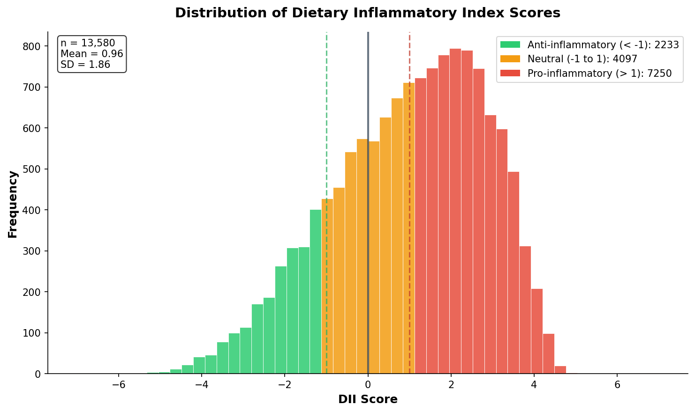

# DII Calculator

[](https://pypi.org/project/dii-calculator/)
[](https://www.python.org/downloads/)
[](https://opensource.org/licenses/MIT)

**A Python implementation of the Dietary Inflammatory Index (DII) for nutritional epidemiology research.**

The Dietary Inflammatory Index is a literature-derived, population-based index that assesses the inflammatory potential of an individual's diet. This package provides a validated implementation for calculating DII scores from nutrient intake data.

---

## Installation

```bash
pip install dii-calculator
```

---

## Quick Start

```python
import pandas as pd
from dii import calculate_dii

# Load your nutrient intake data
nutrients = pd.read_csv("your_data.csv")

# Calculate DII scores
results = calculate_dii(nutrients)
print(results)
```

**Output:**
```
   DII_score
0      -1.23
1       0.45
2       2.87
```

---

## Interpretation

| DII Score | Dietary Pattern |
|-----------|-----------------|
| Negative (< 0) | Anti-inflammatory diet |
| Near zero | Neutral |
| Positive (> 0) | Pro-inflammatory diet |

Scores typically range from **-8** (maximally anti-inflammatory) to **+8** (maximally pro-inflammatory).

---

## Features

### Detailed Output

Get per-nutrient contributions to understand what's driving the score:

```python
detailed = calculate_dii(nutrients, detailed=True)
print(detailed[["Fiber_contribution", "Saturated fat_contribution", "DII_score"]])
```

### Visualization

```python
from dii import plot_dii_distribution, plot_nutrient_contributions

plot_dii_distribution(results)
plot_nutrient_contributions(detailed)
```

<p align="center">
  
</p>

### Command Line

```bash
dii input.csv -o results.csv
dii input.csv --detailed
dii --nutrients  # List supported nutrients
```

---

## Input Format

Your DataFrame should have columns matching DII nutrient names. The package supports all 45 DII parameters:

```csv
participant_id,Fiber,Alcohol,Vitamin C,Saturated fat,Energy
1,18.8,13.98,118.2,28.6,2056
2,25.0,0.0,150.0,22.0,1800
```

Run `dii --nutrients` to see all supported nutrients and their units.

**Note:** Nutrients not in your data are automatically excluded from the calculation.

---

## Validation

Validated against 13,580 NHANES participants with perfect match to the [dietaryindex R package](https://github.com/jamesjiadazhan/dietaryindex).

---

## Citation

If you use this package in your research, please cite:

```bibtex
@software{clark2025dii,
  author = {Clark, Ted and Strath, Larissa},
  title = {dii-calculator: Dietary Inflammatory Index Calculator for Python},
  year = {2025},
  url = {https://github.com/strathlab-data/DII}
}
```

Also cite the original DII methodology:

> Shivappa N, Steck SE, Hurley TG, Hussey JR, Hébert JR. Designing and developing a literature-derived, population-based dietary inflammatory index. *Public Health Nutr*. 2014;17(8):1689-1696.

---

## License

MIT License — see [LICENSE](LICENSE) for details.

---

## Authors

- **Ted Clark** — University of Florida
- **Larissa Strath, PhD** — University of Florida

Department of Health Outcomes and Biomedical Informatics
